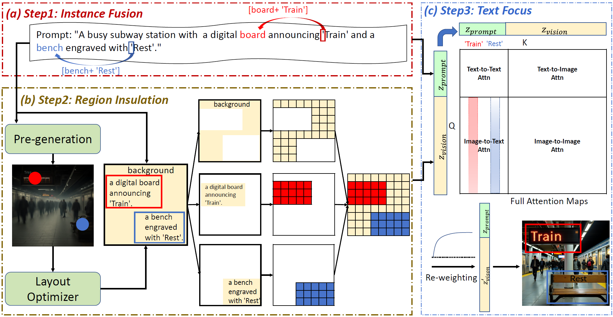

# TextCrafter: Accurately Rendering Multiple Texts in Complex Visual Scenes

[//]: # (<a href='https://arxiv.org/abs/2311.16465'></a>)
<a href='https://github.com/NJU-PCALab/TextCrafter.git'></a>
<a href='https://dnknju.github.io/textcrafter-vue/'></a>
[](https://huggingface.co/datasets/dnkdnk/CVTG-2K)

[//]: # (<a href='https://discord.gg/HVEcfcwdHv'></a>)

[//]: # ([![Replicate]&#40;https://replicate.com/cjwbw/textdiffuser-2/badge&#41;]&#40;https://replicate.com/cjwbw/textdiffuser-2&#41; )


TextCrafter enables precise multi-region visual text rendering, addressing the challenges of long, small-size,various numbers, symbols and styles in visual text generation. We illustrate the comparisons among TextCrafter with three state-of-the-art models: FLUX, TextDiffuser-2 and 3DIS.
* We propose **TextCrafter**, a novel *training-free* framework for rendering multiple texts in complex visual scenes, consisting of three key stages: instance fusion, region insulation, and token focus.

* We construct a new **CVTG-2K** dataset, which encompasses a diverse range of visual text prompts varying in position, quantity, length, and attributes, serving as a robust benchmark for evaluating the performance of generation models in **C**omplex **V**isual **T**ext **G**eneration tasks.

* We conduct extensive quantitative and qualitative experiments on the **CVTG-2K** benchmark. The results demonstrate that **TextCrafter** delivers exceptional performance, proving its superior effectiveness and robustness in tackling the CVTG task. 


## 💡  Methodology



TextCrafter consists of three steps. (a) *Instance Fusion*: Strengthen the connection between visual text and its corresponding carrier. (b) *Region Insulation*: Leverage the positional priors of the pre-trained DiT model to initialize the layout information for each text instance while separating and denoising text prompts across different regions. (c) *Text Focus*: Enhance the attention maps of visual text, refing the fidelity of text rendering.


[//]: # (## 🌟	Highlights)
[//]: # (* ✨ We **release the demo** at [link]&#40;https://huggingface.co/spaces/JingyeChen22/TextDiffuser-2&#41;. Welcome to use and provide feedbacks.)


## ⏱️ News

- __[2025.04.01]__: The dataset is released at [link](https://huggingface.co/datasets/dnkdnk/CVTG-2K).

- __[2025.04.01]__: TextCrafter code has been released and supports Flux and SD3.5!


## 🛠️ Installation

Clone this repo: 
```
git clone https://github.com/NJU-PCALab/TextCrafter.git
cd TextCrafter
```

Build up a new environment and install packages as follows:
```
conda create -n textcrafter python==3.9 -y
conda activate textcrafter
pip install xformers==0.0.28.post1 diffusers==0.32.2 peft==0.14.0 torchvision==0.19.1 opencv-python==4.10.0.84 sentencepiece==0.2.0 protobuf==5.28.1 scipy==1.13.1 six==1.17.0 gurobipy==12.0.0 matplotlib==3.9.4
```

## 🧨 Inference

Running the simple code below to perform inference verify whether the environment is correctly installed.
```bash
cd TextCrafer_FLUX # or cd TextCrafer_SD3
python demo.py
```
If you downloaded the [FLUX.1 dev](https://huggingface.co/black-forest-labs/FLUX.1-dev) or [SD3.5](https://huggingface.co/stabilityai/stable-diffusion-3.5-large)model in advance, please specify the model path in `demo.py` and `pre_generation.py`

**Parameter Description:**

`prompt`: Text description of the entire image.

`carrier_list`: A list of the carriers/locations of each visual text, which can be concrete objects or abstract concepts, but must come from the prompt.

`sentence_list`: A list of individual descriptions for each visual text, which you can extract from the prompt.

`pre_generation_steps`: The number of inference steps required in the pre-generation process. Only a few steps are needed to obtain a rough layout.

`insulation_steps`: The number of reasoning steps performed by *Region Insulation*. The number of insulation is higher, which means the object position is more accurately controlled, but the boundaries may be more obvious.

`num_inference_steps`: Total number of sampling/inference steps.

`cross_replace_steps`: In the *Text Focus* stage, the proportion of steps that perform attention reweight operations

`min_area`: The minimum area of the rectangle when optimizing the layout of each visual text. This parameter should be set to different values ​​for different numbers of visual texts. It is recommended that (1, 2, 3, 4, 5) visual texts correspond to (0.65, 0.3, 0.2, 0.15, 0.12) respectively.

`addition`: In the *Instance Fusion* stage, the control coefficient of embedding addition.

## 📚 Dataset

CVTG-2K is a challenging benchmark dataset comprising 2,000 prompts for complex visual text generation tasks. Generated via OpenAI's O1-mini API using Chain-of-Thought techniques, it features diverse scenes including street views, advertisements, and book covers. The dataset contains longer visual texts (averaging 8.10 words and 39.47 characters) and multiple text regions (2-5) per prompt. Half the dataset incorporates stylistic attributes (size, color, font), enhancing evaluation capabilities. CVTG-2K provides fine-grained information through decoupled prompts and carrier words that express text-position relationships, making it ideal for advancing research in visual text generation and stylization.

After downloading [CVTG-2K.zip](https://huggingface.co/datasets/dnkdnk/CVTG-2K) and extracting it, you will see two folders:

- **CVTG**: Contains data without attribute annotations
- **CVTG-style**: Contains data with attribute annotations

Inside each folder, you will find JSON files named with numbers, such as `1.json` (with fine-grained annotations) and `1_combined.json` (without fine-grained annotations). The numbers in the filenames represent the quantity of visual text regions, ranging from 2 to 5.

```
CVTG-2K/
├── CVTG/                 # Data without attribute annotations
│   ├── 2.json            
│   ├── 2_combined.json   
│   ├── 3.json            
│   ├── 3_combined.json   
│   ├── 4.json            
│   ├── 4_combined.json   
│   ├── 5.json            
│   └── 5_combined.json   
└── CVTG-style/           # Data with attribute annotations
    ├── 2.json            
    ├── 2_combined.json   
    ├── 3.json            
    ├── 3_combined.json   
    ├── 4.json           
    ├── 4_combined.json   
    ├── 5.json            
    └── 5_combined.json   
```

## 💌 Acknowledgement

We feel thankful for the available code/model of [diffusers](https://github.com/huggingface/diffusers.git), [gurobi](https://support.gurobi.com/), [FLUX](https://huggingface.co/black-forest-labs/FLUX.1-dev), [Stable Diffusion](https://huggingface.co/stabilityai/stable-diffusion-3.5-large), [prompt-to-prompt](https://github.com/google/prompt-to-prompt.git), [RAG-Diffusion](https://github.com/NJU-PCALab/RAG-Diffusion.git).

[//]: # (## 📖 Citation)

[//]: # (If you find TextCrafter useful in your research, please consider citing:)

[//]: # (```)

[//]: # (```)
